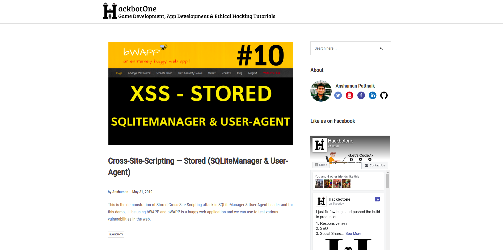

# hackbotone-mern-website
HackbotOne website produce contents from various domains such as Web Hacking, Bug Bounty, Application Development &amp; Game Development. 
[https://hackbotone.com](https://hackbotone.com)




### Installation
``````````````````````````
cd hackbotone-mern-website 
npm install
npm run start-dev
``````````````````````````

### MongoDB database import command
``````````````````````````````````````````````````````````````````````````````````````````````````````````
mongoimport --uri "mongodb://127.0.0.1:27017/blogs" --collection blogs --jsonArray --file dummy_data.json
``````````````````````````````````````````````````````````````````````````````````````````````````````````

### Note
If you face any problem or have any suggestion on improving the code then feel free to raise an issue.
